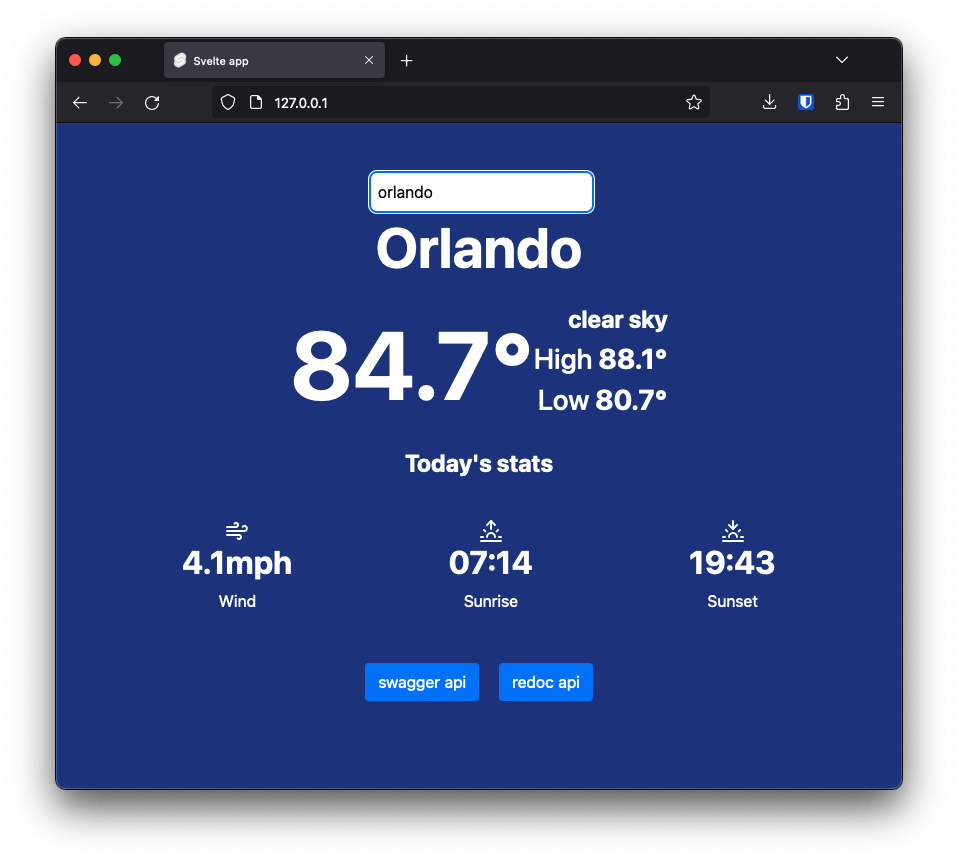
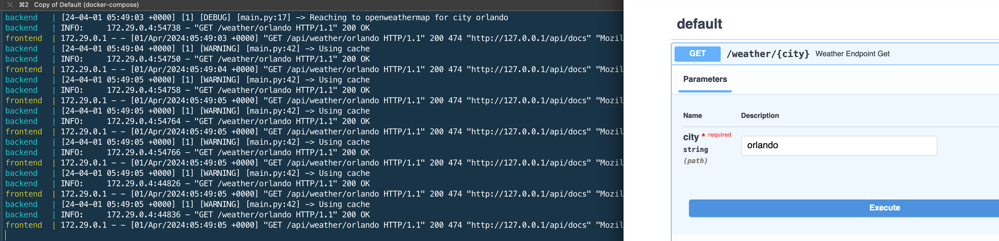

<div align="center">

&nbsp;&nbsp;&nbsp;&nbsp;&nbsp;&nbsp;&nbsp;&nbsp;&nbsp;&nbsp;&nbsp;&nbsp;&nbsp;&nbsp;&nbsp;&nbsp;&nbsp;&nbsp;&nbsp;


<h1 align="center">OliveWeather</h1>

  <p align="center">
    A weather app that caches its data from the OpenWeatherMap API
    <br />

  </p>
<p align="center">




</p>
</div>


## Run the stack 

Create a `.env` file with the following contents
```dotenv
DEV=true
WEATHER_API_KEY=<OPENWEATHERMAP_KEY>
```

Then run the command below:

```bash
docker compose up --build  # might want to add -d to run detached 
```
then access [http://127.0.0.1](http://127.0.0.1)


## Highlights

- The backend uses FastAPI to generate the OpenAPI specification.
- The frontend uses `openapi-client-axios` client to access the backend using the specs generated by FastAPI.
- The Frontend uses Svelte, and it is served with a nginx container
- The nginx config is mapping path `/api/` to the backend container, so the frontend does not experience CORS errors
- Cache is implemented using TTL in Redis

## Cache

Verify that cache is working as expected by running the app and triggering get
requests to the backend quickly. You will notice a log message showing that
cache content is being used



## Future

- Add mod security to the nginx container to implement WAF.
- Update frontend libraries
- Implement unit testing
- Add docker compose file watch
- Add more animations to the frontend
